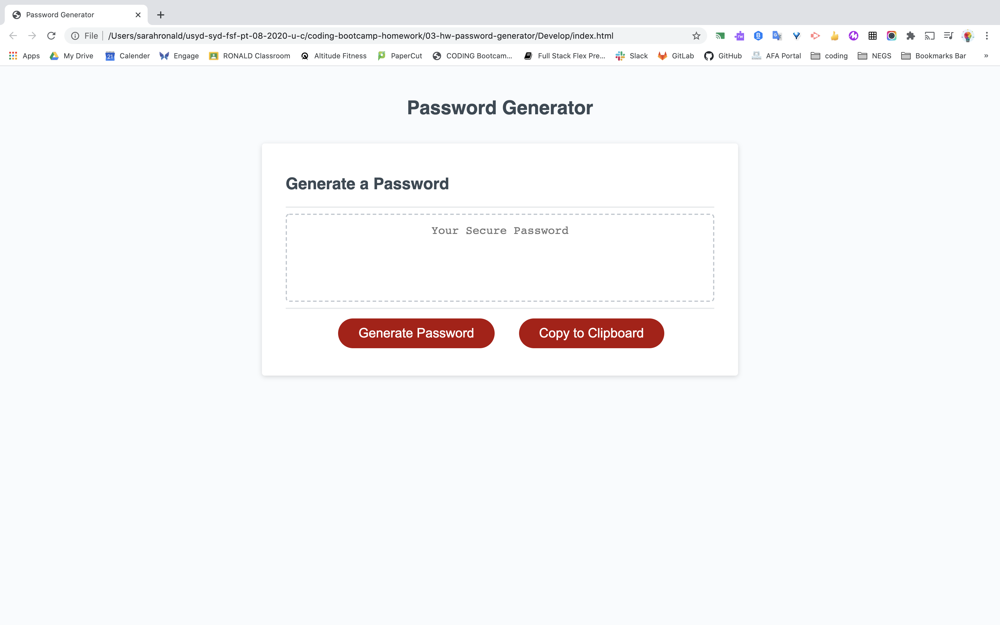

# 03-hw-password-generator
// Homework Task 03 JavaScript Homework: Password Generator //

## Contents
<p> 
This responsive password generator is composed of 3 pages: index.html, style.css and script.js. </p>

## User Story
<p>As an employee with access to sensitive data I want to randomly generate a password that meets certain criteria so that I can create a strong password that provides greater security.</p>

## Acceptance criteria

```
GIVEN I need a new, secure password
WHEN I click the button to generate a password
THEN I am presented with a series of prompts for password criteria
WHEN prompted for password criteria
THEN I select which criteria to include in the password
WHEN prompted for the length of the password
THEN I choose a length of at least 8 characters and no more than 128 characters
WHEN prompted for character types to include in the password
THEN I choose lowercase, uppercase, numeric, and/or special characters
WHEN I answer each prompt
THEN my input should be validated and at least one character type should be selected
WHEN all prompts are answered
THEN a password is generated that matches the selected criteria
WHEN the password is generated
THEN the password is either displayed in an alert or written to the page
```

## Built With
* [Terminal]
* [VScode](https://code.visualstudio.com/) - The editor of choice

#### Initial interface

Format: 

### Licence
Due to the nature of the exercise, no license has been included.

### Link to the App
<p>Password Generator</p>
<a>file:///Users/sarahronald/usyd-syd-fsf-pt-08-2020-u-c/coding-bootcamp-homework/03-hw-password-generator/Develop/index.html</a><hr>

## Authors
* **SARAH RONALD** - 
Contact information:
sareronald@hotmail.com
